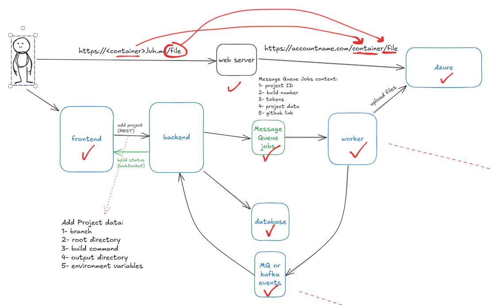
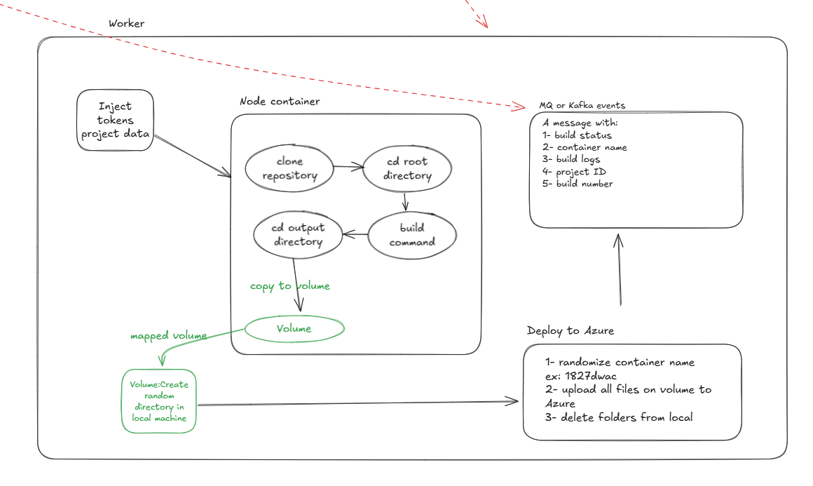

# Static Hosting PoC Round 3 - Building frameworks and backend/workers separation

## Showcasing

- Supports building frontend frameworks as well as static sites.
- Separation between the backend and the workers.
- Saves project and builds information and logs in a database.
- Usage of Redis and BullMQ for communication between the backend and the workers.
- Worker uses DinD (Docker in Docker) pattern to create a container to build the projects on demand.
- Deployment of files on Microsoft Azure.
- Full Kubernetes deployment.
- Completely dockerized.

## Technologies Used

- Azure Blob Storage
- Prisma
- Redis and BullMQ
- TypeScript
- Docker
- Kubernetes

## Demo Video

https://youtu.be/wj-VoOoVZYw

## Architecture

## Test samples

1. Static project

Repository URL: https://github.com/codingstella/vCard-personal-portfolio
Branch: main

2. Multi-page static project

Repository URL: https://github.com/vanzasetia/designo-multi-page-website
Branch: main

3. React project

Repository URL: https://github.com/nightknighto/MyReads-Book-Library
Branch: master
Build Command: npm run build
Output Directory: build

4. Weather React project (note: no API key)

Repository URL: https://github.com/s-shemmee/React-Weather-App
Branch: main
Build Command: npm run build
Output Directory: build