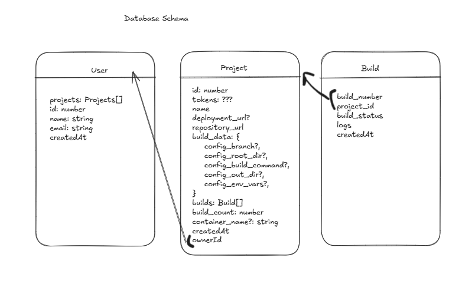

# Static Hosting PoC Round 3 - Building frameworks and backend/workers separation

## Showcasing

- Supports building frontend frameworks as well as static sites.
- Separation between the backend and the workers.
- Saves project and builds information and logs in a database.
- Usage of Redis and BullMQ for communication between the backend and the workers.
- Worker uses DinD (Docker in Docker) pattern to create a container to build the projects on demand.
- Deployment of files on Microsoft Azure.
- Full Kubernetes deployment.
- Completely dockerized.

## Technologies Used

- Azure Blob Storage
- Prisma
- Redis and BullMQ
- TypeScript
- Docker
- Kubernetes

## Demo Video

https://youtu.be/wj-VoOoVZYw

## Architecture

